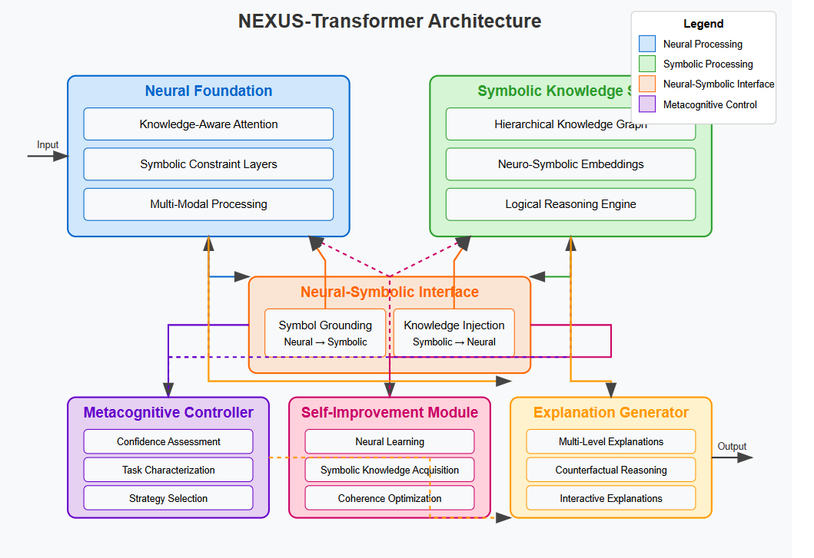

# SSI: Superintelligence Neural-Symbolic

SSI is a new Superintelligence approached using Neural-Symbolic

## Table of Contents
1. [Introduction](#introduction)
2. [Key Features](#key-features)
3. [Architecture](#architecture)
4. [Installation](#installation)
5. [Usage](#usage)
6. [Project Structure](#project-structure)
7. [Postmortem Analysis](#postmortem-analysis)
8. [LessonsLearned](#lessons-learned)
9. [Future Enhancements](#future-enhancements)
10. [Contributing](#contributing)
11. [License](#license)
12. [Contact](#contact) 

## Introduction

Artificial superintelligence (ASI) development represents one of the most profound technological challenges of our time. ASI is defined as "AI systems that surpass human intelligence in all tasks and domains with exceptional thinking skills". 


Unlike artificial narrow intelligence (ANI), which excels at specific tasks, or artificial general intelligence (AGI), which matches human-level capabilities across domains, ASI would significantly outperform humans across all cognitive tasks.


Yoshua Bengio (https://arxiv.org/pdf/2502.15657) emphasized the necessity for deep learning to evolve from "System 1" thinking (intuitive, fast, unconscious cognitive processes) to "System 2" thinking (logical, deliberate, conscious cognitive processes). 


Today, Test-time computing tries to encapsulate System 2 thinking. However, it is not robust.

A robust AI system capable of complex reasoning requires integrating pattern recognition and neural-symbolic.


AI researcher Ilya Sutskever and venture capitalists are putting some $2 billion into Sutskever's secretive company, Safe Superintelligence (SSI), based on a new principle for its model. The most likely method he will use is Neural-Symbolic.

## Key Features

- **Design:** The Neural-Symbolic Paradigm

Neural-symbolic integration combines the strengths of neural networks (learning from data, recognizing patterns) with symbolic systems (logical reasoning, knowledge representation). 


This approach aims to overcome the limitations of each approach when used in isolation:

•	Neural networks excel at pattern recognition and representation learning but often function as "black boxes" with limited interpretability and reasoning capabilities.

•	Symbolic systems provide transparent, rule-based reasoning but lack adaptability and struggle with uncertainty and noisy data.


As detailed in Shenzhe Zhu https://arxiv.org/pdf/2502.12904, neural-symbolic systems can be categorized into three primary frameworks:

1.	Neural for Symbol: Using neural networks to enhance symbolic reasoning, particularly by accelerating knowledge graph reasoning.

2.	Symbol for Neural: Leveraging symbolic systems to provide prior knowledge and logical frameworks to guide and constrain neural networks.

3.	Hybrid Neural-Symbolic Integration: Creating systems where neural and symbolic components interact bidirectionally, each enhancing the other's capabilities.


## Architecture

What This Medical Diagnosis Program Does in Simple Terms

This program acts like a smart doctor's assistant that helps diagnose patients based on their symptoms. It works in three main steps:

Step 1: Pattern Recognition:
First, the program uses a neural network (like a pattern-matching brain) that has been trained on hundreds of patient cases. When you input a patient's symptoms (like fever, cough, headache), this part of the program recognizes patterns it has seen before and makes an initial guess about the diagnosis - like "this looks like the flu" or "this might be COVID-19."

Step 2: Rule Checking:
Next, the program has a built-in medical rulebook that contains doctor's knowledge about different diseases. For example, it knows that COVID-19 typically involves fever, cough, and loss of taste/smell, while a common cold usually has runny nose and sneezing without high fever.

The program checks if the initial guess makes sense according to these medical rules. For instance, if the neural network said "COVID-19" but the patient doesn't have any of the key COVID symptoms, the rulebook would flag this as suspicious.

Step 3: Final Decision:
The program then makes its final decision:

If the initial guess passes the rule check, it confirms the diagnosis

If not, it looks for alternative diagnoses that better match the symptoms

It provides an explanation for why it reached its conclusion, pointing out which symptoms support or contradict the diagnosis
It also gives a confidence score to show how certain it is

Example:
If a patient has fever, cough, and loss of taste/smell, the program might say:

"Diagnosis: COVID-19 (85% confidence)"
"Explanation: Patient has key symptoms of COVID-19: fever, cough, loss of taste/smell"

If a patient has symptoms that don't clearly match any disease, it might say the diagnosis is "Uncertain" and explain why.

The benefit of this approach is that it combines the pattern-recognition power of AI with transparent medical knowledge, making it both accurate and able to explain its reasoning just like a human doctor would.


## Installation

1. Clone the repository:
   ```
   git clone https://github.com/alessoh/ssi1
   cd ssi1
   ```

2. Create and activate a virtual environment:
   ```
   conda create -n ssi1 python=3.12
   conda activate ssi1
   ```

3. Install the required packages:
   ```
   pip install -r requirements.txt
   ```

4. Set up your environment variables:


## Usage

app.py is a simple demo

app2.py is an extended model

appdata.py reads data files

app4.py NEXUS Architecture

app7.py A Neural-Symbolic Architecture for Medical Diagnosis with Transparent Reasoning 

Trans2.py NEXUS-transformer

Trans3.py NEXUS-transformer Upgrade

## NEXUS Project Structure

NEXUS: Neural-Symbolic Superintelligence Architecture

Conceptual Overview

Drawing from the materials provided, I propose a novel framework called NEXUS (Neural-symbolic EXtensible Unified System) that addresses some of the limitations in current approaches while building on their strengths.

The key insight in developing NEXUS is to create a deeply integrated neural-symbolic system where the boundaries between neural and symbolic components become fluid rather than rigid. This differs from existing approaches where these components often operate in separate stages or domains.

Core Components

1. Recursive Bidirectional Knowledge Transformation
NEXUS extends the bidirectional translation mechanism shown in your images with a recursive structure:

Dynamic Neural-Symbolic Mapping: Rather than a single translation function T_n→s, implement a hierarchical set of translation functions that operate at different levels of abstraction.
Continuous Knowledge Refinement: Add a feedback loop where symbolic reasoning results inform neural attention mechanisms in real time, creating a continuously evolving representation.

2. Knowledge Graph Augmented Transformer (KGAT)
Building on the graph attention network formula in Image 2:

Extend the standard transformer architecture with knowledge graph-aware attention mechanisms that explicitly incorporate relational information.

Implement relation-specific attention weights that capture the semantics of different relationship types in the knowledge graph
Allow the model to attend not just to tokens but to entire concepts and their relationships.

3. Metacognitive Control System

Add a higher-order control system that:

Decides when to rely on neural pattern matching versus symbolic reasoning

Allocates computational resources based on task difficulty

Monitors confidence levels and uncertainty in both components

Detects and resolves contradictions between neural and symbolic outputs

4. Multi-Hop Reasoning Bridge

To enable complex reasoning:

Implement an iterative multi-hop reasoning mechanism that traverses the knowledge graph guided by neural attention

Each hop combines neural pattern recognition with symbolic rule application

The system maintains a "reasoning trace" that can be used for explanation and verification

## NEXUS Transformer Model

I've designed a comprehensive neural-symbolic architecture called NEXUS-Transformer that combines the deep integration capabilities of transformer models with explicit knowledge representation and metacognitive control. This system represents a significant advancement toward superintelligent AI with both high performance and interpretability.

Trans2.py NEXUS-transformer



NEXUS-Transformer: Key Components
The NEXUS-Transformer architecture consists of six core components that work together:

Neural Foundation
Knowledge-Aware Attention mechanisms that incorporate symbolic knowledge
Symbolic Constraint Layers that enforce logical rules during processing
Multi-Modal Processing capabilities for handling diverse input types

Symbolic Knowledge Store

Hierarchical Knowledge Graph representing entities and relationships
Neuro-Symbolic Embeddings that bridge neural and symbolic representations
Logical Reasoning Engine for explicit rule application

Neural-Symbolic Interface

Bidirectional translation between neural and symbolic representations
Symbol Grounding that maps neural patterns to symbolic concepts
Knowledge Injection that incorporates symbolic knowledge into neural processing

Metacognitive Controller

Confidence Assessment evaluating reliability of both components
Task Characterization to determine appropriate reasoning strategy
Strategy Selection for dynamically choosing the optimal approach

Self-Improvement Module

Neural Learning through various training approaches
Symbolic Knowledge Acquisition for expanding the knowledge base
Coherence Optimization ensuring consistency between components

Explanation Generator

Multi-Level Explanations for different user needs
Counterfactual Reasoning for exploring alternative scenarios
Interactive Explanations allowing users to probe the system's reasoning

Key Innovations
The NEXUS-Transformer architecture introduces several innovations:

Deep Integration: Neural and symbolic components are integrated at multiple levels, with knowledge-aware attention mechanisms and symbolic constraint layers throughout the neural network.
Bidirectional Information Flow: Information flows seamlessly between neural and symbolic components, with each enhancing the other's capabilities.
Metacognitive Control: A sophisticated control mechanism dynamically determines when to rely on neural versus symbolic reasoning based on confidence, task characteristics, and risk assessment.
Recursive Self-Improvement: The system can improve both its neural and symbolic components based on experience and feedback.
Multi-Level Explanations: The explanation generator produces human-understandable explanations tailored to different user needs and levels of expertise.

This architecture represents a significant step toward AI systems that combine the pattern recognition capabilities of neural networks with the explicit reasoning of symbolic AI, creating systems that are both powerful and transparent. Its applications range from scientific discovery and medical diagnosis to complex system modeling and autonomous decision-making.
The path to superintelligence requires systems that can both learn from data and reason about what they've learned in a human-understandable way. NEXUS-Transformer aims to provide this foundation through its synergistic integration of neural and symbolic approaches.

## Lessons Learned

## Future Enhancements

NEXUS Transformer Architecture Overview
The NEXUS (Neural-symbolic EXtensible Unified System) architecture combines neural networks with symbolic reasoning to create a system that's both powerful and interpretable. At its core, it features:

Deep Integration: Neural and symbolic components work together seamlessly, with knowledge-aware attention mechanisms and bidirectional translation between representations.
Metacognitive Control: A system that determines when to rely on neural pattern recognition versus symbolic reasoning, adapting dynamically based on the task.
Transparency by Design: Unlike post-hoc explanation methods, NEXUS incorporates explainability directly into its architecture.

Development Roadmap
The roadmap progresses through several phases:
Phase 1: Foundational Model (Current Implementation)

Basic neural-symbolic integration
Simple knowledge representation
Initial metacognitive control
Transparency mechanisms

Phase 2: Enhanced Capabilities

Improved neural components (multi-modal, fine-tuning)
Advanced symbolic reasoning (multi-hop, rule learning)
Deeper integration between components
Enhanced metacognitive abilities

Phase 3: Scalable Architecture

Billion-parameter models with efficient computation
Comprehensive knowledge store with domain specialization
Self-improvement mechanisms
Distributed knowledge representation

Phase 4: AGI-Capable System

Advanced cognitive capabilities (abstract reasoning, causal understanding)
Multimodal understanding and generation
Aligned value system with ethical reasoning
Cross-domain problem solving

Phase 5: Path to ASI

Recursive self-improvement within safety bounds
Superintelligent capabilities with cross-domain mastery
Strong safety and control mechanisms
Interpretability at scale

Implementation Strategy
For immediate next steps, I recommend:

Enhance the current NEXUS Transformer prototype:

Scale up the model size (more layers, larger embedding dimensions)
Implement more sophisticated knowledge representation
Improve the bidirectional translation between neural and symbolic components

Expand knowledge graph capabilities:

Implement multi-hop reasoning
Add support for uncertainty and temporal reasoning
Develop mechanisms to learn rules from data

Develop better metacognitive control:

Implement more sophisticated confidence estimation
Add task characterization to better select strategies
Develop resource allocation mechanisms

This development path balances capability advancement with safety, ensuring that interpretability and alignment remain central concerns throughout the system's evolution.

## License

This project is licensed under the MIT License. See the [LICENSE](LICENSE) file for details.

## Contact

- **Homepage:** [AI HIVE](https://www.ai-hive.net)
- **Email:** info@ai-hive.net

For any questions, feedback, or bug reports, please open an issue in the GitHub repository or contact us via email.